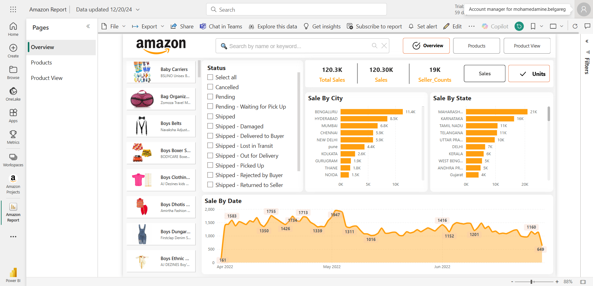
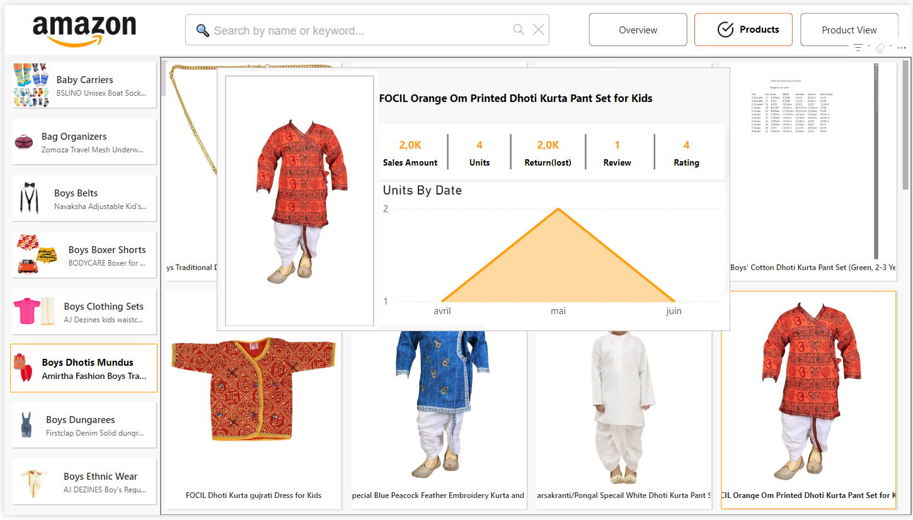
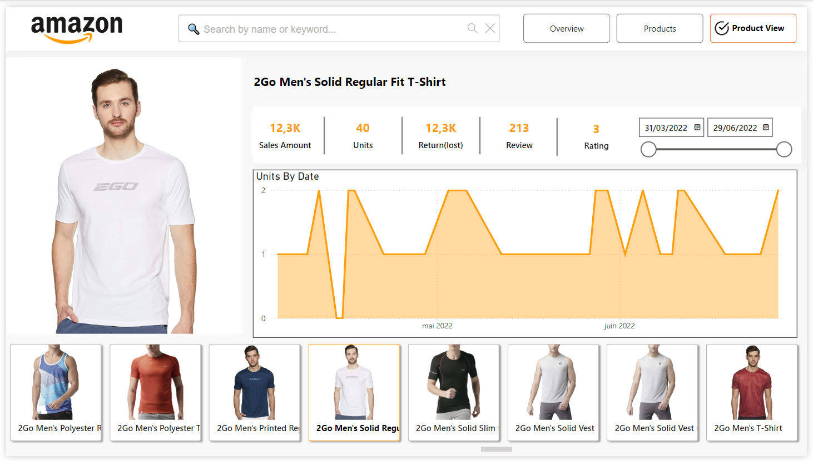

## Amazon Sales Analysis Power BI Project

### Overview
This repository contains a comprehensive Power BI project analyzing Amazon sales data. It includes source files, documentation, and interactive dashboards that provide insights into sales trends, product performance, and logistical improvements.

### Key Features
- **Interactive Dashboards:**
  - Overview of global performance metrics.
  - Detailed product-based insights.
  - In-depth analysis of individual product performance.
- **Data Transformation:**
  - Cleaned and structured datasets for accurate analysis.
  - Applied advanced DAX measures and calculated columns.
- **Visual Design:**
  - Intuitive and professional dashboards with harmonized color palettes.

### Screenshots
#### 1. Overview Dashboard


#### 2. Products Dashboard


#### 3. Product View Dashboard


### Project Links
- **Power BI Service:** [Amazon Sales Dashboard](https://app.powerbi.com/links/ZP7ZwUIRhv?ctid=dbd6664d-4eb9-46eb-99d8-5c43ba153c61&pbi_source=linkShare&bookmarkGuid=19e5c552-6998-4429-a65b-3c0cd4f87214)
- **GitHub Repository:** [Source Files and Documentation](https://github.com/BelgaregMohamedAmine/Amazon-Sales-Analysis)

### How to Use
1. Clone the repository:
```
git clone https://github.com/BelgaregMohamedAmine/Amazon-Sales-Analysis
```
  
2. Open the Power BI files (.pbix) in Power BI Desktop.
3. Explore the dashboards and modify them as needed.

## 🔗 Accéder au rapport interactif Power BI
[👉 Cliquez ici pour visualiser le rapport Power BI](https://app.powerbi.com/view?r=eyJrIjoiZmM0MDY3NjktNGZhZS00YTAxLTg5OWEtYmVlYTIzMTVmYTk2IiwidCI6ImRiZDY2NjRkLTRlYjktNDZlYi05OWQ4LTVjNDNiYTE1M2M2MSIsImMiOjl9)


### Contact
For questions or feedback:
- **Email:** belgaregmohamedamine@outlook.fr
- **Portfolio:** [Your Portfolio Link](https://belgaregmohamedamine.netlify.app/)

### License
This project is licensed under the MIT License. See the LICENSE file for details.
